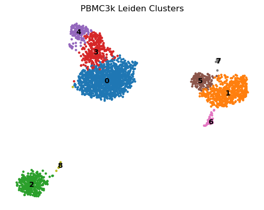
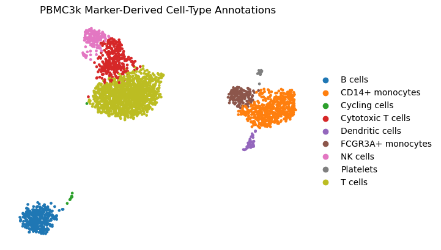

# Single-Cell Marker Reasoning Benchmark

A reproducible single-cell RNA-seq analysis and benchmark-generation project built with **Scanpy**, **AnnData**, **Python**, **pytest**, **Docker**, and structured benchmark assets.

This project converts a standard single-cell RNA-seq workflow into a small but professionally engineered benchmark suite for testing marker-gene reasoning, cluster annotation, contradiction detection, oracle generation, answer validation, and reproducible scoring.

Repository: `gbadedata/single-cell-marker-reasoning-benchmark`

---

## 1. Project Summary

This project analyses the PBMC3k single-cell RNA-seq dataset and builds a benchmark layer on top of the analysis output.

The project does four things:

1. Runs a reproducible Scanpy workflow on PBMC3k.
2. Identifies marker genes for Leiden clusters.
3. Produces marker-derived working cluster annotations.
4. Converts the scientific outputs into benchmark tasks with hidden answers, oracle responses, validators, scoring, calibration assets, tests, and Docker reproducibility.

The result is not just a notebook-style single-cell analysis. It is a structured benchmark engineering project that connects computational biology, scientific software engineering, reproducibility, and evaluation design.

---

## 2. Why This Project Exists

Many single-cell RNA-seq examples stop at preprocessing, clustering, marker-gene ranking, and UMAP visualisation.

This project goes further by asking:

> Can a single-cell analysis workflow be converted into a reproducible benchmark suite for testing biological reasoning?

The benchmark focuses on practical marker-gene reasoning tasks, including:

* identifying cell types from marker genes;
* detecting contradictions between similar immune-cell labels;
* recovering likely cell identities when canonical markers are partially masked;
* scoring solver answers against hidden answers and oracle outputs;
* separating public benchmark inputs from hidden answer keys;
* documenting limitations honestly instead of overstating the benchmark.

---

## 3. Key Features

* Reproducible Scanpy workflow using PBMC3k.
* Structured Python package under `src/scbench`.
* Raw and processed AnnData workflow.
* QC filtering, normalisation, log transformation, highly variable gene selection, PCA, neighbours, UMAP, and Leiden clustering.
* Marker-gene ranking using Wilcoxon testing.
* Filtered marker-gene table to reduce noisy ribosomal, mitochondrial, and housekeeping markers.
* Marker-derived cluster annotation layer.
* Public benchmark tasks.
* Hidden answer files.
* Oracle output generation.
* Validator functions for scoring solver responses.
* Solver scoring report generation.
* Calibration framework and difficulty review.
* Unit and integration test separation.
* Dockerfile for clean-container reproducibility.
* Makefile for repeatable command execution.
* Evidence files documenting test runs and reproducibility outputs.

---

## 4. What Makes This Different From a Standard Scanpy Project

A standard Scanpy project usually demonstrates an analysis workflow.

This project adds a benchmark and evaluation layer.

| Standard Scanpy workflow    | This project                                                     |
| --------------------------- | ---------------------------------------------------------------- |
| Loads single-cell data      | Loads and stores raw AnnData reproducibly                        |
| Performs QC and clustering  | Performs QC and clustering with tests and evidence               |
| Ranks marker genes          | Produces raw and filtered marker tables                          |
| Annotates clusters manually | Stores marker-derived working annotations with confidence levels |
| Ends with figures/tables    | Converts outputs into benchmark tasks                            |
| No hidden answers           | Separates public tasks from hidden answer keys                   |
| No scoring framework        | Implements validators and scoring reports                        |
| No clean-container proof    | Adds Docker pipeline reproducibility                             |

---

## 5. Repository Structure

```text
.
├── benchmark_tasks/
│   ├── public/
│   ├── hidden/
│   ├── oracle_outputs/
│   └── calibration_logs/
├── configs/
├── data/
│   ├── raw/
│   ├── interim/
│   ├── processed/
│   └── external/
├── docs/
│   ├── benchmark_design.md
│   ├── limitations.md
│   ├── methods.md
│   └── evidence/
├── results/
│   ├── tables/
│   ├── figures/
│   ├── metrics/
│   └── reports/
├── sample_solver_answers/
├── scripts/
├── src/
│   └── scbench/
├── tests/
├── Dockerfile
├── Makefile
├── environment.yml
├── pytest.ini
└── README.md
```

---

## 6. Dataset

This project uses the PBMC3k dataset available through Scanpy.

Dataset characteristics:

| Item                 | Value                              |
| -------------------- | ---------------------------------- |
| Dataset              | PBMC3k                             |
| Source access method | `scanpy.datasets.pbmc3k()`         |
| Raw cells            | 2,700                              |
| Raw genes            | 32,738                             |
| Format               | AnnData `.h5ad`                    |
| Biological context   | Peripheral blood mononuclear cells |

The large `.h5ad` files are intentionally not committed to GitHub. They are regenerated through the pipeline.

---

## 7. Analysis Workflow

The workflow is implemented through scripts and reusable Python modules.

### Step 1: Download data

Script:

```text
scripts/01_download_data.py
```

Output:

```text
data/raw/pbmc3k_raw.h5ad
```

### Step 2: Preprocess data

Script:

```text
scripts/02_preprocess.py
```

Main operations:

1. Load raw PBMC3k AnnData.
2. Identify mitochondrial genes.
3. Calculate QC metrics.
4. Filter low-quality cells.
5. Filter lowly detected genes.
6. Filter cells with high mitochondrial percentage.
7. Preserve raw counts in `adata.layers["counts"]`.
8. Normalise total counts.
9. Apply log transformation.
10. Store raw-normalised representation in `adata.raw`.
11. Select highly variable genes.
12. Scale data.
13. Run PCA.
14. Build nearest-neighbour graph.
15. Compute UMAP.
16. Run Leiden clustering.

Output:

```text
data/processed/pbmc3k_processed.h5ad
```

Processed dataset:

| Item               | Value  |
| ------------------ | ------ |
| Processed cells    | 2,694  |
| Processed genes    | 2,000  |
| Clustering method  | Leiden |
| Number of clusters | 9      |

### Step 3: Rank marker genes

Script:

```text
scripts/03_rank_markers.py
```

Outputs:

```text
results/tables/cluster_marker_genes.csv
results/tables/cluster_marker_genes_filtered.csv
```

The project produces both raw and filtered marker tables.

The filtered marker table removes common noisy genes such as:

* ribosomal genes beginning with `RPS`;
* ribosomal genes beginning with `RPL`;
* mitochondrial genes beginning with `MT-`;
* selected housekeeping or broadly expressed genes such as `MALAT1`, `TPT1`, `EEF1A1`, and `B2M`.

This was added because early marker rankings were dominated by ribosomal genes, which reduced the biological usefulness of the benchmark tasks.

### Step 4: Annotate clusters

Script:

```text
scripts/04_annotate_clusters.py
```

Outputs:

```text
results/tables/cluster_annotations.csv
data/processed/pbmc3k_annotated.h5ad
```

Important note:

The annotations are marker-derived working labels, not experimentally validated ground truth.

---

## 8. Visual Results

The project includes UMAP visualisations to show both the unsupervised Leiden clustering output and the marker-derived biological annotation layer.

### UMAP by Leiden Cluster



This figure shows the PBMC3k cells grouped by Leiden cluster after preprocessing, PCA, neighbour graph construction, and UMAP embedding.

### UMAP by Marker-Derived Annotation



This figure shows the same UMAP embedding coloured by marker-derived working cell-type annotations.

The visual outputs are generated by:

```text
scripts/09_generate_visual_outputs.py
```

The benchmark task summary table is saved at:

```text
results/tables/benchmark_task_summary.csv
```

## 9. Cluster Annotation Summary

| Cluster | Working annotation | Confidence | Supporting marker evidence                |
| ------- | ------------------ | ---------- | ----------------------------------------- |
| 0       | T cells            | Medium     | CD3D, CD3E, IL7R, LTB                     |
| 1       | CD14+ monocytes    | High       | LYZ, S100A8, S100A9, FCN1, CST3           |
| 2       | B cells            | High       | CD79A, CD79B, MS4A1, CD74, HLA-DRA        |
| 3       | Cytotoxic T cells  | Medium     | CD3D, CCL5, NKG7, GZMA, CST7              |
| 4       | NK cells           | High       | NKG7, GNLY, GZMB, PRF1, FGFBP2            |
| 5       | FCGR3A+ monocytes  | High       | LST1, FCER1G, FCGR3A, AIF1, IFITM3        |
| 6       | Dendritic cells    | Medium     | HLA-DPA1, HLA-DPB1, HLA-DRA, FCER1A, CST3 |
| 7       | Platelets          | High       | PPBP, PF4, GNG11, SDPR, NRGN              |
| 8       | Cycling cells      | Medium     | KIAA0101, TYMS, ZWINT, TUBB               |

---

## 9. Benchmark Design

The benchmark contains three task families.

### 9.1 Hidden Cluster Annotation

The solver receives marker genes for a cluster and must infer the most likely cell type.

Public input:

```text
benchmark_tasks/public/hidden_cluster_annotation_tasks.json
```

Hidden answer key:

```text
benchmark_tasks/hidden/hidden_cluster_annotation_answers.json
```

Number of tasks:

```text
9
```

### 9.2 Marker Contradiction Detection

The solver receives marker evidence that may create ambiguity or contradiction between related immune-cell labels.

Public input:

```text
benchmark_tasks/public/marker_contradiction_tasks.json
```

Hidden answer key:

```text
benchmark_tasks/hidden/marker_contradiction_answers.json
```

Number of tasks:

```text
2
```

### 9.3 Masked Marker Recovery

The solver receives partially masked marker evidence and must recover the likely cell identity using remaining supporting evidence.

Public input:

```text
benchmark_tasks/public/masked_marker_recovery_tasks.json
```

Hidden answer key:

```text
benchmark_tasks/hidden/masked_marker_recovery_answers.json
```

Number of tasks:

```text
5
```

### Benchmark Summary

| Task family                    | Public tasks | Hidden answers | Purpose                                                |
| ------------------------------ | -----------: | -------------: | ------------------------------------------------------ |
| Hidden cluster annotation      |            9 |              9 | Test marker-to-cell-type reasoning                     |
| Marker contradiction detection |            2 |              2 | Test ability to detect conflicting biological evidence |
| Masked marker recovery         |            5 |              5 | Test reasoning under incomplete marker evidence        |
| Total                          |           16 |             16 | Small benchmark suite                                  |

---

## 10. Oracle Outputs

Oracle outputs provide structured reference responses for benchmark tasks.

Script:

```text
scripts/06_generate_oracle_outputs.py
```

Outputs:

```text
benchmark_tasks/oracle_outputs/hidden_cluster_annotation_oracle_outputs.json
benchmark_tasks/oracle_outputs/marker_contradiction_oracle_outputs.json
benchmark_tasks/oracle_outputs/masked_marker_recovery_oracle_outputs.json
```

Oracle outputs include:

* predicted label;
* supporting genes;
* confidence level;
* rationale.

Example oracle response shape:

```json
{
  "task_id": "task_hidden_annotation_cluster_0",
  "oracle_response": {
    "predicted_label": "T cells",
    "supporting_genes": ["CD3D", "CD3E", "IL7R", "LTB"],
    "confidence": "medium",
    "rationale": "T-cell markers present; broad cluster likely includes naive/memory T cells."
  }
}
```

---

## 11. Validators and Scoring

Validators are implemented in:

```text
src/scbench/validators.py
```

Scoring workflow:

```text
src/scbench/scoring.py
scripts/07_score_solver_answers.py
```

The validators score solver answers using structured criteria.

### Hidden cluster annotation scoring

| Component               | Weight |
| ----------------------- | -----: |
| Correct label           |   0.60 |
| Supporting gene overlap |   0.30 |
| Rationale present       |   0.10 |

Correct threshold:

```text
0.75
```

### Marker contradiction scoring

| Component                      | Weight |
| ------------------------------ | -----: |
| Correct contradiction decision |   0.50 |
| Contradiction type overlap     |   0.35 |
| Rationale present              |   0.15 |

Correct threshold:

```text
0.75
```

### Masked marker recovery scoring

| Component                | Weight |
| ------------------------ | -----: |
| Correct label            |   0.50 |
| Supporting gene overlap  |   0.25 |
| Uncertainty acknowledged |   0.15 |
| Rationale present        |   0.10 |

Correct threshold:

```text
0.75
```

Sample solver answers are stored in:

```text
sample_solver_answers/sample_answers.json
```

Sample score report:

```text
results/reports/sample_solver_score_report.json
```

Current sample scoring result:

| Metric                 | Value |
| ---------------------- | ----: |
| Total sample answers   |     3 |
| Correct sample answers |     3 |
| Accuracy               |   1.0 |
| Average score          | 0.923 |

---

## 12. Calibration Framework

Calibration assets are generated by:

```text
scripts/08_generate_calibration_assets.py
```

Outputs:

```text
benchmark_tasks/calibration_logs/calibration_log_template.json
benchmark_tasks/calibration_logs/initial_task_difficulty_review.json
```

The current calibration layer is a design-stage framework.

It documents:

* task family;
* expected difficulty;
* likely failure modes;
* calibration risks;
* recommended next improvements;
* future human/model evaluation fields.

Important limitation:

This is not yet an empirical frontier-model calibration study. Empirical calibration would require running the benchmark against multiple human solvers or model systems, recording attempts, measuring accuracy, analysing failure patterns, and revising task difficulty based on observed results.

---

## 13. Reproducibility

This project supports both local and Docker-based reproducibility.

### 13.1 Local environment

Create the Conda environment:

```bash
mamba env create -f environment.yml
```

Activate the environment:

```bash
conda activate sc-marker-benchmark
```

Run all tests locally:

```bash
PYTHONPATH=src pytest -q
```

Current full local test status:

```text
34 passed
```

### 13.2 Makefile commands

Run unit tests:

```bash
make unit-test
```

Run integration tests:

```bash
make integration-test
```

Run all tests:

```bash
make test
```

Run the full local pipeline:

```bash
make pipeline
```

Pipeline target sequence:

```text
download → preprocess → markers → annotate → tasks → oracles → score → calibration → test
```

### 13.3 Docker reproducibility

Build the Docker image:

```bash
make docker-build
```

Run Docker unit tests:

```bash
make docker-test
```

Run the full pipeline inside Docker:

```bash
make docker-pipeline-test
```

The full Docker pipeline test regenerates the dataset, preprocessing outputs, marker tables, annotations, benchmark tasks, oracle outputs, scoring report, calibration assets, and test results inside a clean container.

This proves that the project is not dependent only on local files already existing on the developer machine.

---

## 14. Unit and Integration Test Strategy

The project separates lightweight tests from data-dependent tests.

### Unit tests

Unit tests do not require generated `.h5ad` files.

Run:

```bash
make unit-test
```

### Integration tests

Integration tests require generated data files and full pipeline outputs.

Run:

```bash
make integration-test
```

This split was introduced after Docker testing exposed that the original tests assumed local generated data files already existed. The fix made the test strategy more realistic and CI-friendly.

---

## 15. Evidence Map

Evidence files are stored under:

```text
docs/evidence/
```

Important evidence files:

| Evidence file                                 | What it proves                      |
| --------------------------------------------- | ----------------------------------- |
| `01_project_tree.txt`                         | Initial project structure           |
| `02_pytest_day1.txt`                          | Early baseline test status          |
| `03_dataset_load_output.txt`                  | PBMC3k dataset loading worked       |
| `06_preprocessing_output.txt`                 | Preprocessing pipeline output       |
| `08_marker_ranking_output.txt`                | Marker ranking completed            |
| `09_annotation_output.txt`                    | Cluster annotation completed        |
| `11_benchmark_generation_output.txt`          | Benchmark task generation completed |
| `14_oracle_generation_output.txt`             | Oracle output generation completed  |
| `17_solver_scoring_output.txt`                | Solver scoring completed            |
| `21_calibration_assets_output.txt`            | Calibration assets generated        |
| `24_unit_tests_after_docker_split.txt`        | Unit tests after test split         |
| `25_integration_tests_after_docker_split.txt` | Integration tests after test split  |
| `26_docker_unit_test_output.txt`              | Docker unit tests completed         |
| `27_docker_full_pipeline_test_output.txt`     | Full Docker pipeline completed      |

The evidence files are intentionally kept in the repository to show the project was built, tested, and improved through verifiable stages.

---

## 16. Key Engineering Challenges and How They Were Fixed

This section documents the real issues encountered during the project and how they were resolved.

### Challenge 1: Accidental Git repository creation in the wrong directory

Early in the project, Git was accidentally initialised from the home directory rather than the intended project directory.

Why this mattered:

* It risked tracking unrelated personal or system files.
* It made the repository structure unclear.
* It could have caused accidental commits from outside the project.

Fix:

* Removed the mistaken home-level Git setup.
* Recreated the project inside the correct directory.
* Reinitialised Git only inside the intended project root.
* Verified the repository with `pwd`, `ls`, and `git status`.

Result:

The final repository is clean, scoped correctly, and pushed to GitHub from the correct project directory.

---

### Challenge 2: Raw marker ranking was dominated by noisy genes

The first marker ranking output contained many ribosomal and broadly expressed genes.

Why this mattered:

* These genes are not always useful for cell-type reasoning.
* They can make benchmark tasks biologically weaker.
* They reduce the clarity of marker-to-cell-type inference.

Fix:

* Added marker filtering logic.
* Removed genes beginning with `RPS`, `RPL`, and `MT-`.
* Removed selected broadly expressed genes such as `MALAT1`, `TPT1`, `EEF1A1`, and `B2M`.
* Produced both raw and filtered marker tables.

Result:

The benchmark tasks became more biologically meaningful while still preserving the raw marker output for transparency.

---

### Challenge 3: Cluster labels could be overstated as ground truth

Marker-derived annotations can be useful, but they are not the same as experimentally validated ground truth.

Why this mattered:

* Overclaiming would weaken scientific credibility.
* Benchmark answer keys should not pretend to be absolute truth when they are derived from marker evidence.
* Closely related immune-cell populations can share markers.

Fix:

* Described cluster labels as marker-derived working annotations.
* Added confidence levels.
* Documented limitations clearly.
* Used rationale and supporting genes in oracle outputs.

Result:

The project remains scientifically honest while still producing useful benchmark assets.

---

### Challenge 4: Hidden answer files were initially blocked by `.gitignore`

The benchmark design requires public tasks and hidden answer files. However, hidden answer files were initially at risk of being ignored by Git.

Why this mattered:

* The benchmark would be incomplete without answer keys.
* A user cloning the repository might not be able to reproduce scoring.
* Oracle generation and validation depend on hidden answer files.

Fix:

* Adjusted `.gitignore`.
* Kept broad protection for hidden/generated files.
* Explicitly allowed the required hidden JSON answer files and oracle outputs to be tracked.

Result:

The repository now contains the benchmark task files needed for reproducible scoring.

---

### Challenge 5: Docker tests failed because generated `.h5ad` files were excluded

The Docker image intentionally excluded large generated data files.

Why this mattered:

* This is good repository hygiene.
* But the original tests assumed local `.h5ad` files already existed.
* In a clean Docker container, those files were missing, so data-dependent tests failed.

Fix:

* Added `pytest.ini`.
* Marked data-dependent tests as `integration`.
* Added Makefile targets for:

  * `unit-test`;
  * `integration-test`;
  * `docker-test`;
  * `docker-pipeline-test`.
* Changed Docker default test command to run non-integration tests.
* Added full Docker pipeline execution to regenerate data from scratch.

Result:

The project now supports both fast Docker unit testing and full clean-container pipeline reproducibility.

---

### Challenge 6: Docker full pipeline initially failed because `make` was missing

The first Docker full-pipeline command failed because the container did not include the Linux `make` package.

Why this mattered:

* The Makefile was the main project command interface.
* Docker needed to support the same command interface as local development.

Fix:

* Updated the Dockerfile to install `make`.
* Also installed `tree` for evidence generation support.
* Rebuilt the Docker image.
* Re-ran Docker tests.

Result:

The Docker container can now run the project’s Makefile targets.

---

### Challenge 7: Calibration needed to be honest, not exaggerated

It would have been easy to claim the benchmark was fully calibrated, but the current calibration is design-stage only.

Why this mattered:

* A serious benchmark needs empirical validation.
* Design-stage difficulty review is useful but not the same as human/model calibration.
* Overstating calibration would damage trust.

Fix:

* Created a calibration log template.
* Created an initial task difficulty review.
* Documented the limitation clearly.
* Identified what future empirical calibration would require.

Result:

The project has a calibration framework without pretending that empirical calibration has already been completed.

---

### Challenge 8: Scanpy warnings appeared during full pipeline execution

The Docker full pipeline produced warnings about sparse matrix densification and future Leiden backend changes.

Why this mattered:

* Warnings are not failures, but they are important in scientific computing.
* Sparse matrix densification can become a memory issue on larger datasets.
* Future backend changes can affect reproducibility across Scanpy versions.

Fix:

* Confirmed that the warnings did not stop the pipeline.
* Kept the environment pinned through `environment.yml`.
* Documented the warnings as known technical limitations.

Result:

The current PBMC3k workflow remains valid, but future scaling should address sparse operations and Leiden backend settings explicitly.

---

## 17. Current Project Status

| Area                            | Status              |
| ------------------------------- | ------------------- |
| Data download                   | Complete            |
| Scanpy preprocessing            | Complete            |
| Marker ranking                  | Complete            |
| Marker filtering                | Complete            |
| Cluster annotation              | Complete            |
| Benchmark task generation       | Complete            |
| Hidden answer generation        | Complete            |
| Oracle output generation        | Complete            |
| Validators                      | Complete            |
| Solver scoring                  | Complete            |
| Calibration framework           | Complete            |
| Unit/integration test split     | Complete            |
| Docker unit testing             | Complete            |
| Docker full pipeline test       | Complete            |
| GitHub repository               | Published           |
| GitHub Actions CI               | Not yet implemented |
| Visual figures in README        | Not yet implemented |
| Empirical benchmark calibration | Not yet implemented |

---

## 18. Limitations

This project is intentionally transparent about its current limitations.

1. The benchmark is based on PBMC3k only.
2. Cluster annotations are marker-derived working labels, not experimentally validated ground truth.
3. The benchmark has 16 tasks, so it is a prototype-scale benchmark.
4. The calibration framework is design-stage, not empirical calibration across multiple solvers or models.
5. The current README does not yet include UMAP images or marker plots.
6. GitHub Actions CI has not yet been added.
7. The workflow is suitable for PBMC3k scale but would need memory and performance review for much larger datasets.
8. Scanpy warnings about sparse densification and Leiden backend changes should be addressed in future hardening.

---

## 19. Future Improvements

Planned improvements include:

1. Add UMAP figures by Leiden cluster and marker-derived annotation.
2. Add marker-gene heatmaps or dot plots.
3. Add a benchmark task summary CSV.
4. Add GitHub Actions CI for unit tests.
5. Add optional Docker-based CI.
6. Add empirical calibration using human or model solvers.
7. Add more datasets beyond PBMC3k.
8. Add stronger task difficulty tiers.
9. Add richer scoring reports with per-task error analysis.
10. Add a formal evidence map linking every claim in the README to files in the repository.

---

## 20. Quickstart

Clone the repository:

```bash
git clone https://github.com/gbadedata/single-cell-marker-reasoning-benchmark.git
cd single-cell-marker-reasoning-benchmark
```

Create the environment:

```bash
mamba env create -f environment.yml
conda activate sc-marker-benchmark
```

Run tests:

```bash
PYTHONPATH=src pytest -q
```

Run the full local pipeline:

```bash
make pipeline
```

Build Docker image:

```bash
make docker-build
```

Run Docker unit tests:

```bash
make docker-test
```

Run the full Docker pipeline:

```bash
make docker-pipeline-test
```

---

## 21. Main Technologies

| Category             | Tools                                                             |
| -------------------- | ----------------------------------------------------------------- |
| Language             | Python                                                            |
| Single-cell analysis | Scanpy, AnnData                                                   |
| Data structures      | pandas, NumPy                                                     |
| Testing              | pytest                                                            |
| Reproducibility      | Conda, Mamba, Docker                                              |
| Automation           | Makefile                                                          |
| Version control      | Git, GitHub                                                       |
| Benchmark design     | Public tasks, hidden answers, oracle outputs, validators, scoring |

---

## 22. Project Outcome

This project demonstrates how a single-cell RNA-seq analysis can be transformed into a reproducible benchmark system.

It shows:

* scientific data processing;
* marker-gene reasoning;
* careful cluster annotation;
* benchmark task construction;
* hidden answer management;
* oracle response generation;
* validator-based scoring;
* calibration planning;
* Docker reproducibility;
* evidence-based project documentation.

The project is currently a strong prototype benchmark suite. Its next major improvements are visual result assets, GitHub Actions CI, and empirical calibration.
